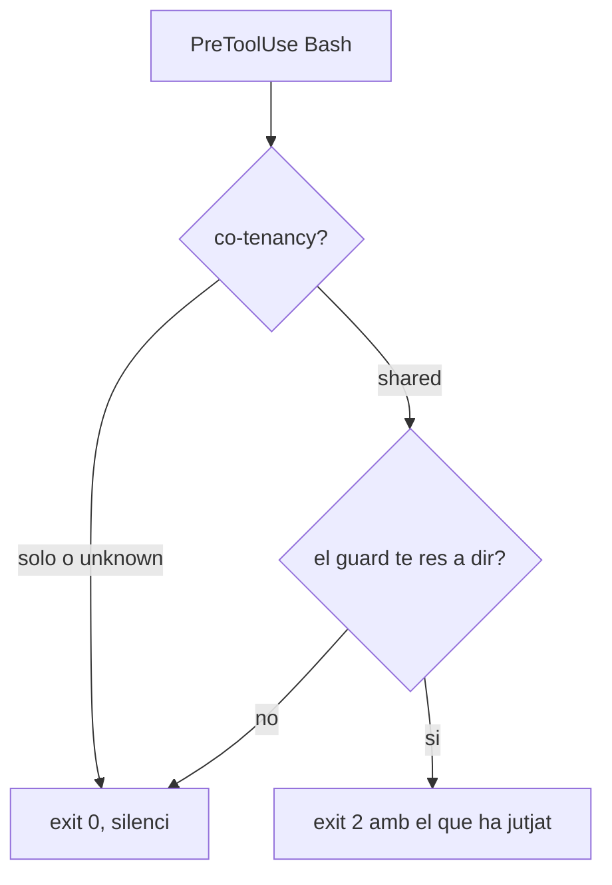

# DESIGN — shared-tree-guards

> Implementa `SPEC.md`. Nivell: **MEDIUM** (repo nou, ~14 fitxers, un sol mòdul, sense estat
> compartit fora de `.git/`).

## KB check

| Font | Què aporta |
|---|---|
| `specs/worktree-guard-decisio/` | Precedent de decisió sobre guards de worktree al KB |
| `specs/workspace-worktree-tier-model/` | El model Tier 1/2 — **el motiu pel qual `worktree-guard` NO viatja** |
| `knowledge/setup/machines/claude-code-machine-bootstrap.md` §4 | Els plugins viuen a `~/.claude/plugins/`, són **per màquina** i no viatgen per git |
| `.claude/rules/ai-first-solutions.md` | Postura AI-first i quan el determinista és la resposta |
| `.claude/rules/no-afirmar-sense-verificar.md` | El control negatiu obligatori de cada guard |

**Greenfield en el codi**, no en el criteri: els tres components existeixen i corren; això els
desacobla del KB.

## La decisió que ho sosté tot: els guards es porten ON quan hi ha co-tenancy

Un guard que bloqueja dins del repo d'un desconegut té un radi d'impacte molt més gran que al
nostre. Un fals positiu aquí és una persona que no pot commitejar i desinstal·la.

**Però el problema que resolen NOMÉS existeix si hi ha més d'una sessió a l'arbre.** Amb una sola
sessió, l'índex és teu i `git commit` sense pathspec és perfectament legítim — que és com treballa
tothom. Per tant:

> `cotenancy` no és una tercera funcionalitat: és la **precondició** que fa que les altres dues es
> puguin publicar. Amb `solo`, els guards callen del tot.

Això fa que per a la immensa majoria d'instal·lacions el plugin sigui **indistingible de no
tenir-lo**, i que només aparegui quan el seu supòsit es compleix.



```text
  PreToolUse(Bash)
        │
        ▼
   co-tenancy?
   ├── solo / unknown ──────────────► exit 0, silenci
   └── shared ──► el guard jutja
                  ├── res a dir ───► exit 0
                  └── troballa ────► exit 2 + que ha jutjat
```

⚠️ **El cost d'aquesta decisió, dit clar**: si algú comparteix arbre amb una eina que NO registra
sessió (un script, un altre agent, un cron), el plugin el veurà com a `solo` i callarà justament
quan caldria. És una limitació real i va al README, no a un comentari.

## Arquitectura del repo

Un sol repo que és **alhora marketplace i plugin** — el patró de `claude-code-plugins`, verificat
al disc (`~/.claude/plugins/marketplaces/claude-code-plugins/`).

```text
claude-shared-tree-guards/
├── .claude-plugin/
│   └── marketplace.json          # el marketplace: llista 1 plugin
├── plugins/shared-tree-guards/
│   ├── .claude-plugin/plugin.json
│   ├── hooks/hooks.json          # PreToolUse(Bash) x2 + SessionStart x1
│   ├── hooks-handlers/
│   │   ├── commit-guard.cjs
│   │   ├── overwrite-guard.cjs
│   │   └── cotenancy.cjs         # SessionStart + mode CLI --list
│   ├── lib/
│   │   ├── git.cjs               # git(), gitCommonDir(), fail-open
│   │   ├── payload.cjs           # llegir stdin, treure la comanda
│   │   └── sessions.cjs          # registre a <git-common-dir>/claude-sessions/
│   └── README.md
├── test/
│   ├── run-cases.mjs             # parametritza sobre cases.yaml, repos git temporals
│   └── negative-control.mjs      # cada guard ha de poder fallar
├── SPEC.md · cases.yaml          # copiats d'aqui
├── .github/workflows/ci.yml      # ubuntu-latest + windows-latest
├── LICENSE (MIT) · README.md
```

`hooks.json` referencia els handlers amb **`${CLAUDE_PLUGIN_ROOT}`** (verificat en un plugin real),
que és el que substitueix el nostre `$WORKSPACE_ROOT` i els fa portables sense configuració.

## Map de fitxers

```
CREATE  .claude-plugin/marketplace.json
CREATE  plugins/shared-tree-guards/.claude-plugin/plugin.json
CREATE  plugins/shared-tree-guards/hooks/hooks.json
CREATE  plugins/shared-tree-guards/hooks-handlers/commit-guard.cjs     # port de .claude/hooks/git-commit-guard.cjs
CREATE  plugins/shared-tree-guards/hooks-handlers/overwrite-guard.cjs  # port de .claude/hooks/git-overwrite-guard.cjs
CREATE  plugins/shared-tree-guards/hooks-handlers/cotenancy.cjs        # NOU
CREATE  plugins/shared-tree-guards/lib/{git,payload,sessions}.cjs
CREATE  plugins/shared-tree-guards/README.md
CREATE  test/run-cases.mjs · test/negative-control.mjs
CREATE  .github/workflows/ci.yml · LICENSE · README.md · package.json (devDep: yaml)
COPY    SPEC.md · cases.yaml
MODIFY  (KB) knowledge/setup/machines/INDEX.md — el plugin com a via de propagacio a DELL/WORKSTATION
```

## `sessions.cjs` — el registre

| Decisió | Per què |
|---|---|
| Viu a `<git-common-dir>/claude-sessions/` | `git rev-parse --git-common-dir` és compartit pels worktrees d'un clon i **no** entre clons: abast de detecció == abast del problema, per construcció |
| Un fitxer per PID (`<pid>.json`) | Escriptures independents: dues sessions mai xoquen al mateix fitxer. Mateix patró que `acta-<dia>-<HOST>.jsonl` |
| Vivacitat amb `process.kill(pid, 0)` | Portable, sense spawns. `ESRCH` = mort; `EPERM` = viu i d'un altre usuari |
| Es guarda `startedAt` i `cwd` | Per al missatge (*"2 altres sessions, la més antiga de fa 3 h"*) |
| Entrades mortes: s'ignoren i s'esborren de passada | DR-7. Mai demanar neteja a ningú |

⚠️ **Límit assumit: reciclatge de PID.** El sistema operatiu pot reassignar un PID i fer semblar
viva una entrada morta. Conseqüència: un avís de `shared` de més. Com que la co-tenancy **només
avisa** (DR-6) i el que fa és **activar** els guards —no bloquejar per si mateixa— el pitjor cas és
que els guards estiguin actius sense caldre. Acceptat; comprovar la data d'arrencada del procés
costaria un spawn de PowerShell a cada sessió i no ho paga.

## Port dels dos guards existents

Canvis respecte de la versió del KB, tots per portabilitat:

1. `WORKSPACE_ROOT` → arrel del repo derivada de `git rev-parse --show-toplevel` (0 aparicions al
   commit-guard, 0 al overwrite-guard: mesurat).
2. Trets els 3 comentaris amb referències al KB del `overwrite-guard`.
3. Afegit el gate de co-tenancy al davant dels dos.
4. Variables d'escapatòria unificades: `SHARED_TREE_GUARDS_OFF=1` (totes) i
   `SHARED_TREE_GUARDS_WARN=1` (avisa en lloc de bloquejar).

## Konceptos: NO viatgen al repo públic

Els `DR-1`, `DR-2`, `DR-5` i `DR-8` són `[koncepto-candidate]` a l'spec. **Decisió: no es creen
`.koncept/` en aquest repo.** Koncepto és governança interna del workspace; un repo públic que
l'arrossegui demana a qui hi contribueixi que entengui un sistema que no és seu.

En el seu lloc, **cada invariant es converteix en una prova** (que és el que un koncepto vigila, un
nivell més amunt):

| DR | Com es verifica al repo públic |
|---|---|
| DR-1 | AC-01..AC-05 |
| DR-2 | AC-06, AC-07 |
| DR-3 | AC-12, AC-14 |
| DR-4 | AC-13, i una prova que el missatge de bloqueig nomena la variable |
| DR-5 | AC-15 |
| DR-8 | prova nova: després de córrer els 3 guards, `git status --porcelain` no ha canviat |

## Riscos

| Risc | Mitigació |
|---|---|
| **Fals positiu al repo d'un desconegut** | El gate de co-tenancy (silenci amb `solo`) + `WARN=1` + `OFF=1` documentats al primer paràgraf del README |
| Cost a cada `git commit` | Amb `solo`, una lectura de directori. Amb `shared`, un `git diff --cached`. **A mesurar a `/03-tasks`**, no a assumir |
| El registre com a superfície nova dins de `.git/` | Només fitxers propis en un subdirectori propi; DR-8 ho prova |
| Windows (quoting, PATH, `process.kill`) | CI a `windows-latest` des del primer commit, no al final |
| Manteniment públic (issues) | El README diu l'abast i el que **no** promet: això redueix el dany de compartir arbre, no el fa segur |

## Rollback

Desinstal·lar el plugin no deixa estat. L'únic rastre és `<git-common-dir>/claude-sessions/`,
esborrable sense conseqüències. El KB manté els seus hooks registrats a mà fins que el plugin
estigui verd a les dues plataformes.

## Fora d'abast en aquest disseny

- Que el KB passi a consumir el plugin. Es decideix quan el plugin estigui verd; avui duplicar-ho
  és més segur que migrar.
- Publicar-ho al marketplace oficial d'Anthropic. Primer el repo propi.
