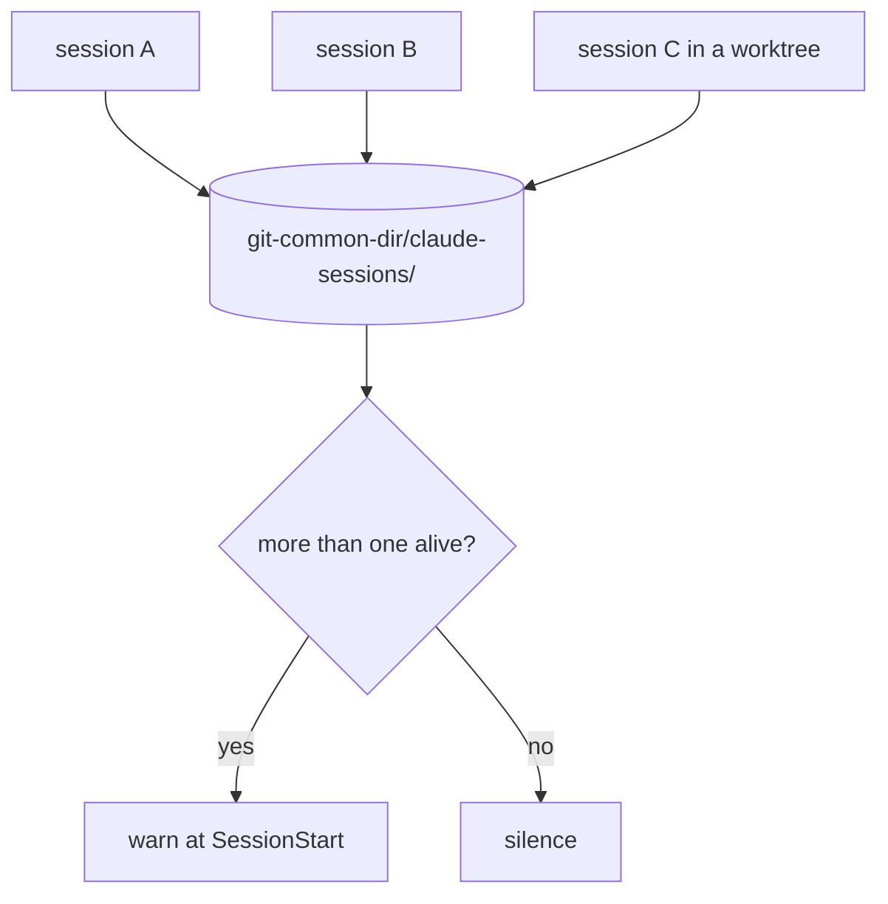

# shared-tree-guards — a Claude Code plugin for working trees shared by more than one session

> **Scope, first, because it is the whole design.** This is for **Claude Code sessions**. N
> sessions at once on **one git clone**. Git has a single index and a single working tree per
> clone, so ordinary commands become destructive without warning. The industry answer is to
> avoid the situation (one worktree per agent); this is for when you cannot.
>
> It detects **Claude Code sessions**, because they are what registers. Anything else sharing
> the tree is invisible to it: see "Known limit" below. That is a deliberate boundary, not an
> oversight.

## Context and state of the art (verified 2026-09-24)

| Source | What it says |
|---|---|
| [Claude Code docs](https://code.claude.com/docs/en/worktrees) | `claude --worktree`, `EnterWorktree`, enforcement at the tool level. **Opt-in** |
| [claude-code#52051](https://github.com/anthropics/claude-code/issues/52051) | Asked for an automatic worktree per session. Closed `not_planned` |
| [claude-code#90943](https://github.com/anthropics/claude-code/issues/90943) | `data-loss`, open, with a repro. Proposes two remedies: **(1)** detect co-tenancy, **(2)** block a commit carrying a staged deletion of a live file |
| claude-squad · vibe-kanban · Conductor | **Orchestration only**, on top of worktrees. None adds index isolation |

**The gap**: nobody has made sharing a tree *safe*; it has been avoided. There is no public tool
that detects co-tenancy or guards a shared index. This plugin fills that gap, for Claude Code.

## Boundaries

**In**: three pieces, all `PreToolUse(Bash)` or `SessionStart`/`SessionEnd`, zero configuration,
no dependencies.

1. `commit-guard` — the index holds things this command did not stage.
2. `overwrite-guard` — `checkout`/`restore`/`reset --hard`/`clean` over paths with live changes.
3. `cotenancy` — a registry of sessions inside `.git`, and a warning when there is more than one.

**Out**: anything that is not a Claude Code session; a worktree guard (that encodes one
workspace's own tier model); anything that touches the VCS or orchestrates agents.

## Known limit, stated up front

The co-tenancy gate only sees what **registers**, and only Claude Code sessions with this plugin
loaded do. Share a working tree with a script, a cron, an editor plugin that commits on a timer,
or another agent CLI, and the plugin will report `solo` and stay quiet exactly when it should
speak.

This is the price of the decision that makes it publishable (see below). It is in the README as
well, in the first third, because a user has to know it before they rely on it.

## Why the registry lives inside `.git`

The scope of the contention is exactly `git rev-parse --git-common-dir`: every worktree of a
clone shares it, and two different clones never do. Putting the registry there makes **the scope
of detection and the scope of the problem the same thing by construction**, with no process
enumeration and nothing OS-specific.



```text
  session A ─┐
  session B ─┼──►  <git-common-dir>/claude-sessions/<session_id>.json
  worktree  ─┘            │
                          ▼
                   more than one alive?  ── yes ──►  warn
                          │
                          └────────  no ────►  silence
```

## Interface contract

All three hooks speak the Claude Code hook protocol:

```
Input  (stdin): { "tool_input": { "command": "<the bash command>" }, "cwd": "...", ... }
Output (stderr): a human message, only when blocking
Exit:   0 = pass · 2 = block (the message reaches the model)
```

A guard in warn mode (`SHARED_TREE_GUARDS_WARN=1`) exits 0 and sends the text through
`hookSpecificOutput.additionalContext` on stdout, because **stderr with exit 0 does not reach
the model** (measured; see DOCTRINE D-09).

`cotenancy` also exposes a CLI: `node cotenancy.cjs --list [--json] [--scope tree|clone]`.

## Domain rules

- **DR-1** — A commit must contain exactly what the same invocation staged. If the index holds
  more, the intent is not expressed and it is blocked.
- **DR-2** — A staged deletion of a file that **exists on disk** is not a deletion: it is an index
  older than HEAD. The single legitimate exception is `git rm --cached`.
- **DR-3** — No guard may fail closed because of its own error: if it cannot measure, it **passes**
  (fail-open) and never blocks on an exception of its own.
- **DR-4** — Every guard carries an environment-variable escape hatch, and the blocking message
  names it.
- **DR-5** — A block must print **what it judged** (the command, or the concrete paths). An
  unexplained block gets switched off.
- **DR-6** — Co-tenancy detection **warns, never blocks**: sharing a tree can be deliberate.
- **DR-7** — A session entry with a dead PID is debris and is ignored; nobody is asked to clean up.
- **DR-8** — No guard writes outside `<git-common-dir>/claude-sessions/`. Not the index, not
  refs, not the working tree.

## Co-tenancy states

| State | Condition |
|---|---|
| `solo` | 0 other live entries |
| `shared` | ≥1 other live entry in scope |
| `unknown` | not inside a repo, or `.git` is not writable |

Two scopes, and they are not interchangeable:

- **`clone`** — every session under the same `--git-common-dir`. What the SessionStart banner
  reports; those sessions really do share refs, objects and the stash.
- **`tree`** — only sessions with the same `--show-toplevel`. What the **guards** use.

| State | Action | Precondition | Result |
|---|---|---|---|
| any | SessionStart | a git repo | writes its entry → `solo` or `shared` |
| `shared` | SessionStart | — | prints a warning: how many, and since when |
| `solo` | SessionStart | — | silence |
| `unknown` | SessionStart | — | silence (never an error in the user's face) |
| any | SessionEnd | — | removes its entry |

## Edge cases

- Empty index → pass (there is nothing to carry away).
- `git commit --amend` with no pathspec → treated like any other commit.
- ` -- ` **inside the commit message** is not a pathspec. The scan skips quoted regions.
  *(measured 2026-09-24: a naive search waved the entire index through — a silent false negative)*
- **Multi-line** commit message: the command must not be split on newlines.
- Filenames with spaces or accents → quoted paths.
- A read-only `.git`, or a filesystem without permissions → `unknown`, silence.
- **Two worktrees of the same clone** count as shared **for the banner** (they share refs, objects
  and the stash) but **not for the guards**: measured 2026-09-24, a linked worktree has its own
  index at `.git/worktrees/<name>/index` and its own working tree. A guard scoped to the clone
  would block **every commit** in a workspace that opens one worktree per session, which is
  exactly the workflow this exists for. Hence the two scopes of `state()`.
- **Two different clones** → never count.
- A PID recycled by the OS → the entry also carries the transcript, and liveness requires both.

## Acceptance criteria

- [ ] A `git commit` with no pathspec, with the index holding paths the command did not stage, exits 2 (case: AC-01)
- [ ] The same with ` -- ` inside the commit message **also** exits 2 (case: AC-02)
- [ ] A `git commit` with a real pathspec passes with 0 even if the index holds foreign paths (case: AC-03)
- [ ] A `git commit` that stages and commits the same paths passes with 0 (case: AC-04)
- [ ] An empty index passes with 0 (case: AC-05)
- [ ] A commit with a staged deletion of a file that exists on disk exits 2 (case: AC-06)
- [ ] A real deletion (the file is gone) passes with 0 (case: AC-07)
- [ ] `git checkout <ref> -- <path>` with that path modified and uncommitted exits 2 (case: AC-08)
- [ ] The same with the path clean passes with 0 (case: AC-09)
- [ ] With two live entries, detection returns `shared` and the right count (case: AC-10)
- [ ] With one dead-PID entry, detection returns `solo` (case: AC-11)
- [ ] Outside a git repo, all three hooks exit 0 with no output (case: AC-12)
- [ ] With the escape hatch set, the guard exits 0 (case: AC-13)
- [ ] An internal error in the guard (git missing from PATH) exits 0, never 2 (case: AC-14)
- [ ] The blocking message contains the command or the paths it judged (case: AC-15)
- [ ] With **a single session** (`solo`), the AC-01 case passes with 0 and no output (case: AC-16)
- [ ] A `git rm --cached` in the SAME command is not mistaken for a stale index and passes with 0 (case: AC-17)
- [ ] A session in a **linked worktree** of the same clone is not an index co-tenant (case: AC-18)
- [ ] With **a single session**, `git checkout <ref> -- <path>` over a dirty path passes with 0 and no output (case: AC-19)
- [ ] A `git commit` with no pathspec is **not** blocked merely because a session exists in a linked worktree (case: AC-20)

## Verification

- `cases.yaml` alongside this file, and a runner that parametrises over it against the **real**
  hooks, in temporary git repositories created by the test. No mocks of git.
- **A negative control is mandatory for every guard**: a test that fails if the guard stops being
  able to block. The guards this was ported from were born with a bench that measured the
  fail-open instead of the gate (3 of 6 tests passed for the wrong reason, measured 2026-09-24),
  and a freshness check written the same day could not fail in either of its two controls.
- CI on GitHub Actions: Linux **and Windows** (the quoting and PATH traps are Windows traps).

## Migration and rollback

- The three pieces existed first as hand-registered hooks in one workspace; the plugin
  **decouples** them, it does not replace them. Until the plugin has flown green for a while,
  that workspace keeps its own hooks.
- Rollback: uninstalling leaves no state. The only trace is
  `<git-common-dir>/claude-sessions/`, which can be deleted with no consequences.

## Explicitly out of scope

- Making it safe to share a working tree. **It cannot be done**: these guards reduce the damage,
  they do not remove it. The README has to say so, or it promises what the industry already
  decided not to promise.
- Orchestrating agents, managing worktrees, or touching the VCS.
- Detecting anything that is not a Claude Code session.
