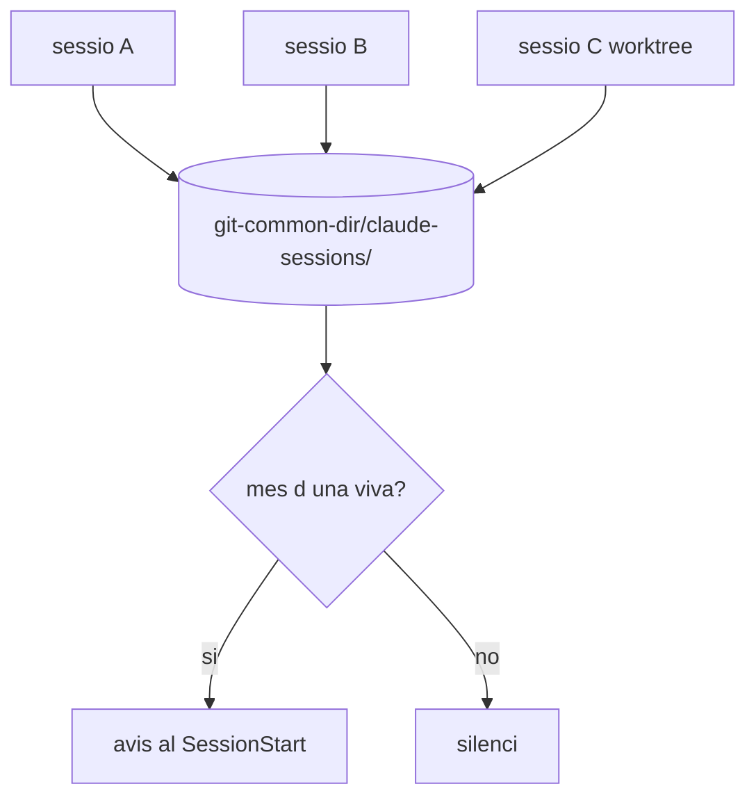

# shared-tree-guards — plugin de Claude Code per a arbres de treball compartits

> **Què resol.** N agents alhora sobre **un mateix clon de git**. Git té un sol índex i un sol
> working tree per clon, així que operacions normals passen a ser destructives sense avisar.
> La resposta d'indústria és evitar-ho (un worktree per agent); això és per a qui **no pot**.

## Context i estat de l'art (verificat 24/09/2026)

| Font | Què diu |
|---|---|
| [docs de Claude Code](https://code.claude.com/docs/en/worktrees) | `claude --worktree`, `EnterWorktree`, enforcement a nivell de tool. **Opt-in** |
| [claude-code#52051](https://github.com/anthropics/claude-code/issues/52051) | Demanava worktree automàtic per sessió. Tancat `not_planned` |
| [claude-code#90943](https://github.com/anthropics/claude-code/issues/90943) | `data-loss`, oberta, amb repro. Proposa dos remeis: **(1)** detectar co-tenancy, **(2)** bloquejar commit amb supressió stagejada de fitxer viu |
| claude-squad · vibe-kanban · Conductor | **Només orquestren** damunt de worktrees. Cap afegeix aïllament d'índex |

**El buit**: ningú ha fet *segur* compartir un arbre; s'ha evitat. No hi ha cap eina pública que
detecti co-tenancy ni que guardi l'índex compartit. Aquest plugin ocupa aquest buit.

## Abast

**Dins**: tres peces, totes `PreToolUse(Bash)` o `SessionStart`, zero configuració, cap dependència.

1. `commit-guard` — l'índex conté coses que aquesta comanda no ha stagejat.
2. `overwrite-guard` — `checkout`/`restore`/`reset --hard`/`clean` sobre camins amb canvis vius.
3. `cotenancy` — registre de sessions dins de `.git/` i avís quan n'hi ha més d'una.

**Fora**: worktree-guard (encodifica el model Tier del KB, mesurat: 15 referències pròpies i la
lògica de junctions cap a Drive). Res que toqui el VCS ni que orquestri agents.

## Per què el registre viu dins de `.git/`

L'abast de la contenció és exactament **`git rev-parse --git-common-dir`**: tots els worktrees
d'un clon el comparteixen, i dos clons diferents no. Posant el registre allà, **l'abast de la
detecció i l'abast del problema són el mateix per construcció**, sense enumerar processos ni
dependre del sistema operatiu.



```text
  sessio A ─┐
  sessio B ─┼──►  <git-common-dir>/claude-sessions/<pid>.json
  worktree ─┘            │
                         ▼
                  mes d'una viva?  ── si ──►  avis
                         │
                         └──────── no ────►  silenci
```

## Contracte d'interfície

Els tres hooks parlen el protocol de hooks de Claude Code:

```
Input  (stdin): { "tool_input": { "command": "<la comanda bash>" }, ... }
Output (stderr): missatge humà, nomes quan bloqueja
Exit:   0 = passa · 2 = bloqueja (el missatge arriba al model)
```

`cotenancy` a més exposa un mode CLI: `node cotenancy.cjs --list` imprimeix les sessions vives.

## Domain rules

- **DR-1** — Un commit ha de contenir exactament el que la mateixa invocació ha stagejat.
  Si l'índex té més, la intenció no està expressada i es bloqueja. `[koncepto-candidate]`
- **DR-2** — Una supressió stagejada d'un fitxer que **existeix al disc** no és una supressió:
  és un índex anterior al HEAD. Excepció legítima única: `git rm --cached`. `[koncepto-candidate]`
- **DR-3** — Cap guard pot fallar tancat per un error propi: si no pot mesurar, **passa**
  (fail-open) i no bloqueja mai per una excepció seva.
- **DR-4** — Cada guard porta escapatòria per variable d'entorn, i el missatge de bloqueig la diu.
- **DR-5** — Un bloqueig ha d'imprimir **què ha jutjat** (la comanda o els camins concrets). Un
  bloqueig inexplicable es desactiva. `[koncepto-candidate]`
- **DR-6** — La detecció de co-tenancy **avisa, mai bloqueja**: compartir arbre pot ser deliberat.
- **DR-7** — Una entrada de sessió amb PID mort és residu i s'ignora; no es demana neteja a ningú.
- **DR-8** — Cap guard escriu fora de `<git-common-dir>/claude-sessions/`. No toca l'índex, ni
  refs, ni l'arbre de treball. `[koncepto-candidate]`

## Estats de la detecció de co-tenancy

| Estat | Condició |
|---|---|
| `solo` | 0 altres entrades vives |
| `shared` | ≥1 altra entrada viva amb el mateix git-common-dir |
| `unknown` | no som dins d'un repo, o `.git` no és escrivible |

| Estat | Acció | Precondició | Resultat |
|---|---|---|---|
| qualsevol | SessionStart | repo git | escriu la seva entrada → `solo` o `shared` |
| `shared` | SessionStart | — | imprimeix avís amb quantes i des de quan |
| `solo` | SessionStart | — | silenci |
| `unknown` | SessionStart | — | silenci (mai un error a la cara de l'usuari) |

## Casos límit

- Índex buit → passa (no hi ha res a endur-se).
- `git commit --amend` sense pathspec → mateix tracte que un commit normal.
- ` -- ` **dins del missatge** de commit: no és un pathspec. L'escaneig salta regions entre cometes.
  *(mesurat 24/09/2026: una cerca ingènua deixava passar l'índex sencer — fals negatiu silenciós)*
- Missatge de commit **multilínia**: la comanda no es pot partir per salts de línia.
- Fitxer amb espais o accents al nom → camins amb cometes.
- `.git` de només lectura o filesystem sense permisos → `unknown`, silenci.
- Dos worktrees del mateix clon → compten com a compartits **per al banner** (comparteixen refs,
  objectes i stash), però **NO per als guards**: mesurat 24/09/2026, un worktree enllaçat té
  el seu propi índex a `.git/worktrees/<nom>/index` i el seu propi arbre. Un guard que
  bloqueja per abast de clon bloquejaria **cada commit** d'un workspace que obre un worktree
  per sessió — que és exactament el workflow per al qual existeix això. D'aquí els dos abasts
  de `state()`: `clone` (informatiu) i `tree` (el que fan servir els guards).
- Dos clons diferents → **no** compten.
- PID reciclat pel sistema operatiu → l'entrada porta també la data d'arrencada del procés.

## Acceptance criteria

- [ ] Un `git commit` sense pathspec amb l'índex contenint camins que la comanda no ha stagejat surt amb 2 (case: AC-01)
- [ ] El mateix amb ` -- ` dins del missatge de commit **també** surt amb 2 (case: AC-02)
- [ ] Un `git commit` amb pathspec real passa amb 0 encara que l'índex tingui coses alienes (case: AC-03)
- [ ] Un `git commit` que stageja i commiteja els mateixos camins passa amb 0 (case: AC-04)
- [ ] Índex buit passa amb 0 (case: AC-05)
- [ ] Un commit amb supressió stagejada d'un fitxer que existeix al disc surt amb 2 (case: AC-06)
- [ ] Una supressió real (el fitxer no hi és) passa amb 0 (case: AC-07)
- [ ] `git checkout <ref> -- <path>` amb el path modificat i sense commitejar surt amb 2 (case: AC-08)
- [ ] El mateix amb el path net passa amb 0 (case: AC-09)
- [ ] Amb dues entrades vives, la detecció retorna `shared` i el nombre correcte (case: AC-10)
- [ ] Amb una entrada de PID mort, la detecció retorna `solo` (case: AC-11)
- [ ] Fora d'un repo git, els tres hooks surten amb 0 i sense sortida (case: AC-12)
- [ ] Amb la variable d'escapatòria posada, el guard surt amb 0 (case: AC-13)
- [ ] Un error intern del guard (git inexistent al PATH) surt amb 0, mai amb 2 (case: AC-14)
- [ ] El missatge de bloqueig conté la comanda o els camins que ha jutjat (case: AC-15)
- [ ] Amb **una sola sessió** (`solo`), el mateix cas d'AC-01 passa amb 0 i sense sortida (case: AC-16)
- [ ] Un `git rm --cached` a la MATEIXA comanda no es confon amb un índex vell i passa amb 0 (case: AC-17)
- [ ] Una sessió en un worktree **enllaçat** del mateix clon no compta com a co-tenant d'índex (case: AC-18)
- [ ] Amb **una sola sessió**, `git checkout <ref> -- <path>` sobre un camí brut passa amb 0 i sense sortida (case: AC-19)
- [ ] Un `git commit` sense pathspec **no** es bloqueja perquè hi hagi una sessió en un worktree enllaçat (case: AC-20)

## Verificació

- `cases.yaml` germà + un runner que parametritza sobre ell contra els hooks **reals**, en repos
  git temporals creats per la prova. Cap mock de git.
- **Control negatiu obligatori a cada guard**: una prova que falla si el guard deixa de poder
  bloquejar. Els guards actuals van néixer amb el banc de proves mesurant el fail-open en lloc del
  gate (3 de 6 proves passaven per la raó equivocada, mesurat 24/09/2026), i el check de frescor
  del mateix dia no podia fallar en cap dels seus dos controls.
- CI a GitHub Actions: Linux i **Windows** (les trampes de quoting i de PATH són de Windows).

## Migració i rollback

- Les tres peces existeixen ja al KB i corren a HP; el plugin les **desacobla**, no les substitueix.
  Fins que el plugin no estigui verd, el KB segueix amb els seus hooks registrats a mà.
- Rollback: desinstal·lar el plugin no deixa estat; l'únic rastre és
  `<git-common-dir>/claude-sessions/`, que es pot esborrar sense conseqüències.

## Fora d'abast, explícitament

- Fer segur compartir un arbre. **No es pot**: aquests guards redueixen el dany, no el suprimeixen.
  El missatge del README ha de dir-ho, o promet el que la indústria ja va decidir no prometre.
- Orquestrar agents, gestionar worktrees, o tocar el VCS.
